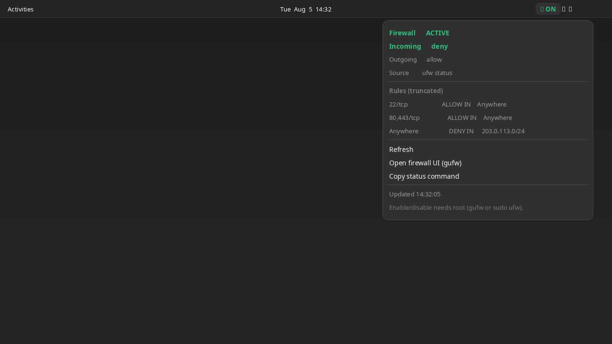

# UFW Status

GNOME Shell extension: top-panel **UFW firewall status** (active/inactive, defaults, rules snapshot).



## Features

- Panel badge: **ON** (active) / **OFF** (inactive)
- Default incoming / outgoing policies when `ufw status` is readable
- Truncated rules list in the menu
- Refresh on a timer and when the menu opens
- Open `gufw` or `firewall-config` if installed
- Copy `sudo ufw status verbose` for terminal use

## Requirements

- GNOME Shell **45–50**
- Optional: `ufw`, `gufw`

## Install

```bash
UUID=ufw-status@n0l0g1c.github.io
mkdir -p ~/.local/share/gnome-shell/extensions
cp -a "$UUID" ~/.local/share/gnome-shell/extensions/
gnome-extensions enable "$UUID"
```

Log out/in on Wayland (or restart GNOME Shell) so the extension is discovered.

## How status is read

1. Prefer `ufw status` (system binary, non-interactive, read-only)
2. If that fails (permissions / missing), read `/etc/ufw/ufw.conf` for `ENABLED=`
3. Optional fallback: `nft list ruleset` presence hint

The extension **does not** enable or disable the firewall and **does not** run `pkexec` or other privileged helpers. Use gufw or `sudo ufw` for policy changes.

## Screenshots

| File | Contents |
|---|---|
| [`screenshots/screenshot.png`](screenshots/screenshot.png) | Primary store image — firewall active |
| [`screenshots/screenshot-off.png`](screenshots/screenshot-off.png) | Firewall inactive |
| [`screenshots/icon.png`](screenshots/icon.png) | Optional icon asset |

## Packaging

```bash
./pack.sh
# → ufw-status@n0l0g1c.github.io.shell-extension.zip
```

Zip contents: `metadata.json`, `extension.js`, `stylesheet.css`, `LICENSE`.

This project follows the [GNOME Shell extension review guidelines](https://gjs.guide/extensions/review-guidelines/review-guidelines.html) (no bundled binaries, unprivileged status only, processes exit cleanly, lifecycle cleanup, GPL-2.0-or-later).

## Development

```bash
cp -a ufw-status@n0l0g1c.github.io \
  ~/.local/share/gnome-shell/extensions/
journalctl -f /usr/bin/gnome-shell
```

## License

[GPL-2.0-or-later](LICENSE)

## Author

[N0L0g1c](https://github.com/N0L0g1c)
